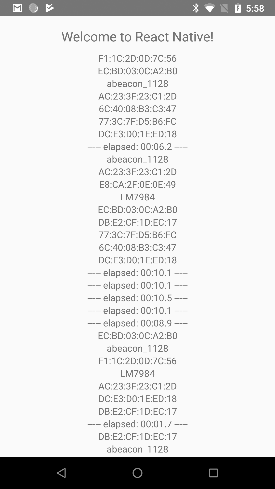

This is a React Native example app that uses [react-native-background-timer](https://github.com/ocetnik/react-native-background-timer) to write both a timestamp and the results of a bluetooth scan every 10 seconds to a Redux store. The [react-native-ble-plx](https://github.com/Polidea/react-native-ble-plx) package is used for Bluetooth scanning.

**As shown in the screenshot below, if the app loses focus, the 10 second timestamp messages continue but the Bluetooth Scanning stops**


## Try it Out

```
git clone https://github.com/rgstephens/RNBackgroundTimerBLE.git
yarn
react-native link
npm start
react-native run-android
```

## Interval Method

- [ ] Uses [react-native-background-job](https://github.com/vikeri/react-native-background-job)
- [x] Uses [react-native-background-timer](https://github.com/ocetnik/react-native-background-timer)
- [ ] Simple setInterval
- [ ] option to start Foreground Service

## Action Performed at Each 10 Second Interval

- [x] Writes timestamp to Redux store
- [x] Calls bluetoothScan from [react-native-ble-plx](https://github.com/Polidea/react-native-ble-plx) for devices



## Steps to Build From Scratch

```
react-native init RNBackgroundTimerBLE
cd RNBackgroundTimerBLE
yarn add react-native-background-timer react-native-ble-plx
yarn add advlib base64-js buffer redux react-redux
react-native link
npm start
react-native run-android
```
